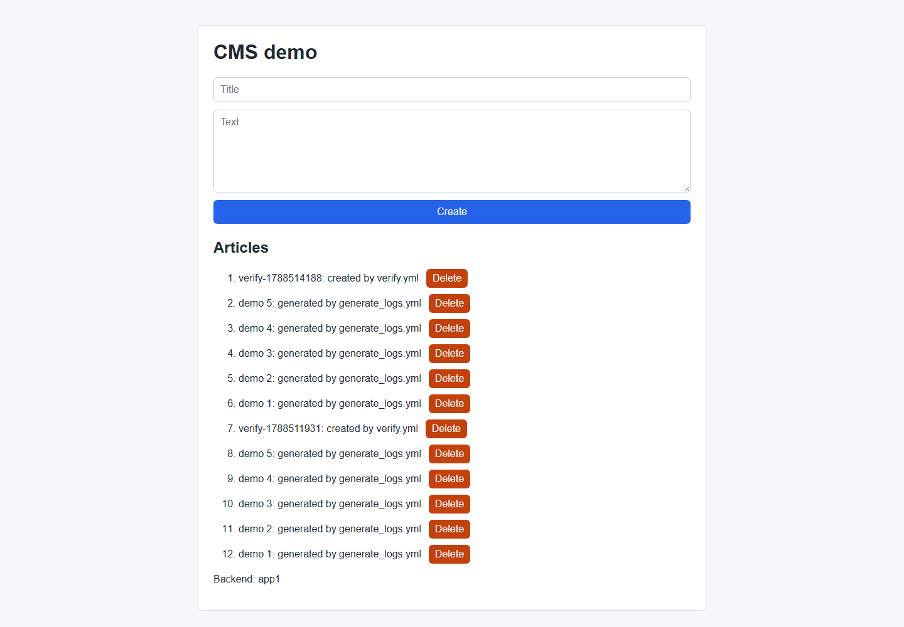
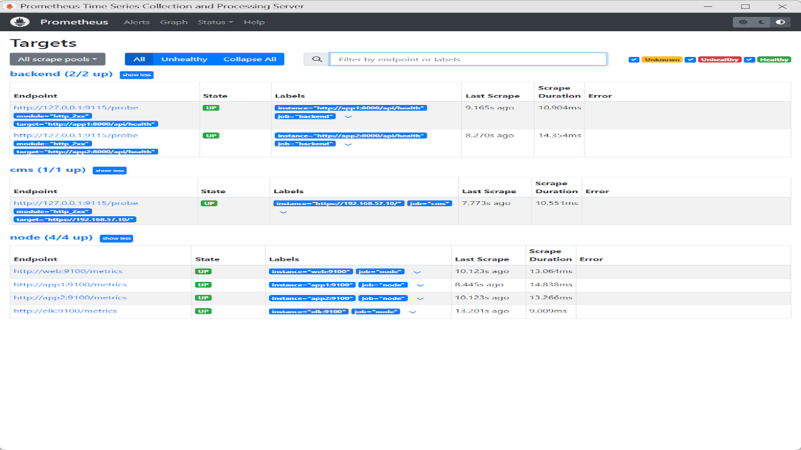
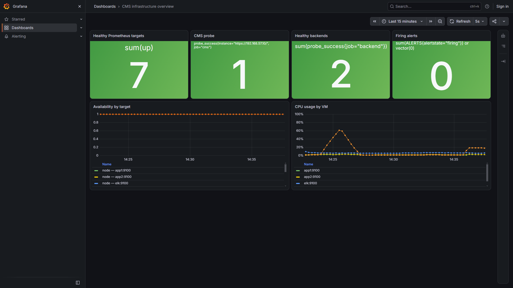
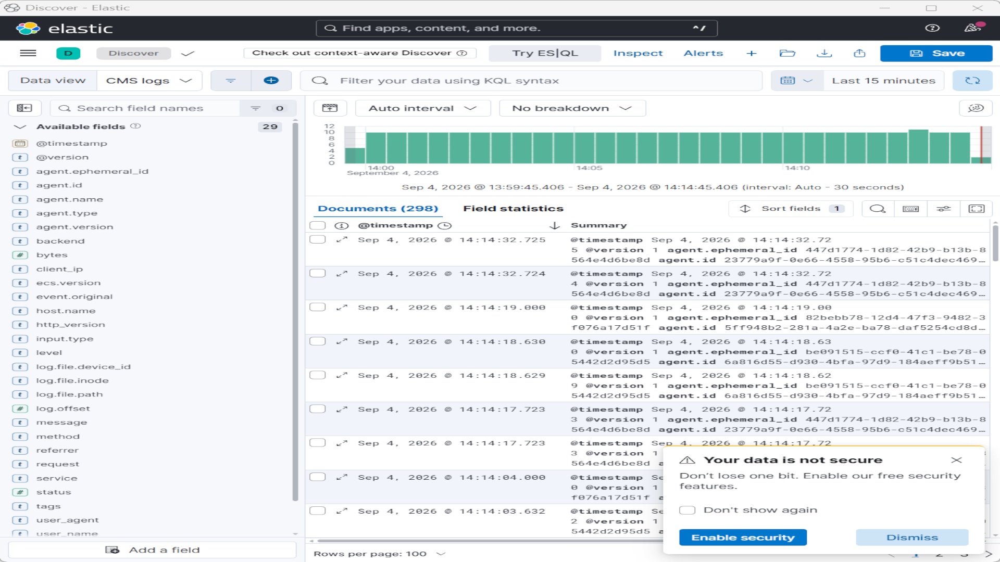

# Сценарий полной демонстрации

Этот документ оформлен как отчёт о последовательной демонстрации: запуск стенда, проверка всех подсистем, контролируемые отказы и редеплой через «голый» snapshot `preprovisioning` и Ansible.

## URL для просмотра из Windows

Адреса соответствуют `Vagrantfile` и пробросу портов на `127.0.0.1`:

| Компонент                   | URL в браузере Windows                                                                          |
| --------------------------- | ----------------------------------------------------------------------------------------------- |
| CMS HTTP / HTTPS            | `http://localhost:5666` / `https://localhost:5777`                                              |
| Prometheus Targets / Alerts | `http://localhost:9090/targets` / `http://localhost:9090/alerts`                                |
| Alertmanager                | `http://localhost:9093`                                                                         |
| Grafana                     | `http://localhost:3000/d/cms-overview/cms-infrastructure-overview` (автоматический Viewer-вход) |
| Kibana                      | `http://localhost:5601`                                                                         |
| Elasticsearch API           | `http://localhost:9200`                                                                         |

Сертификат CMS самоподписанный, поэтому использовать в командах `curl.exe -k`. Предупреждение браузера подтвердить до начала записи. Адреса `192.168.57.10`–`192.168.57.13` относятся к внутренней сети VM; в браузере Windows их не использовать.

Использовать путь репозитория `C:\Users\dandy\administrator-linux-professional\project`.

### Единый блок поднятия системы: Windows + WSL

Windows PowerShell:

```powershell
cd C:\Users\dandy\administrator-linux-professional\project
vagrant up
vagrant status
wsl bash -lc 'cd /mnt/c/Users/dandy/administrator-linux-professional/project && export ANSIBLE_CONFIG=./ansible.cfg && ./scripts/generate_inventory.sh && ansible-playbook -i inventory/hosts.ini playbooks/site.yml && ansible-playbook -i inventory/hosts.ini playbooks/generate_logs.yml && ansible-playbook -i inventory/hosts.ini playbooks/verify.yml'
```

Затем подготовить в WSL окружение для остальных сцен:

```bash
cd /mnt/c/Users/dandy/administrator-linux-professional/project
export ANSIBLE_CONFIG=./ansible.cfg
./scripts/generate_inventory.sh

W='ssh.exe -p 50001 -i C:/Users/dandy/administrator-linux-professional/project/.vagrant/machines/web/virtualbox/private_key -o StrictHostKeyChecking=no -o UserKnownHostsFile=NUL vagrant@127.0.0.1'
A1='ssh.exe -p 50100 -i C:/Users/dandy/administrator-linux-professional/project/.vagrant/machines/app1/virtualbox/private_key -o StrictHostKeyChecking=no -o UserKnownHostsFile=NUL vagrant@127.0.0.1'
A2='ssh.exe -p 50400 -i C:/Users/dandy/administrator-linux-professional/project/.vagrant/machines/app2/virtualbox/private_key -o StrictHostKeyChecking=no -o UserKnownHostsFile=NUL vagrant@127.0.0.1'
E='ssh.exe -p 50500 -i C:/Users/dandy/administrator-linux-professional/project/.vagrant/machines/elk/virtualbox/private_key -o StrictHostKeyChecking=no -o UserKnownHostsFile=NUL vagrant@127.0.0.1'
```

## Полностью рабочая система

### 1. VM и сервисы

Windows PowerShell:

```powershell
vagrant status
vagrant ssh web -c "sudo systemctl is-active nginx filebeat node_exporter"
vagrant ssh app1 -c "sudo systemctl is-active cms-backend postgresql filebeat node_exporter cms-backup.timer"
vagrant ssh app2 -c "sudo systemctl is-active cms-backend postgresql filebeat node_exporter"
vagrant ssh elk -c "sudo systemctl is-active prometheus alertmanager grafana-server elasticsearch logstash kibana blackbox_exporter node_exporter"
```

Фактический вывод `vagrant status` при записи `01-working-system.mkv`:

```text
Current machine states:

web                       running (virtualbox)
app1                      running (virtualbox)
app2                      running (virtualbox)
elk                       running (virtualbox)

This environment represents multiple VMs. The VMs are all listed
above with their current state. For more information about a specific
VM, run `vagrant status NAME`.
```

Фактические выводы проверок сервисов:

```text
> vagrant ssh web -c "sudo systemctl is-active nginx filebeat node_exporter"
active
active
active

> vagrant ssh app1 -c "sudo systemctl is-active cms-backend postgresql filebeat node_exporter cms-backup.timer"
active
active
active
active
active

> vagrant ssh app2 -c "sudo systemctl is-active cms-backend postgresql filebeat node_exporter"
active
active
active
active

> vagrant ssh elk -c "sudo systemctl is-active prometheus alertmanager grafana-server elasticsearch logstash kibana blackbox_exporter node_exporter"
active
active
active
active
active
active
active
active
```

### 2. CMS, API и балансировка

Windows PowerShell:

```powershell
curl.exe -sS -o NUL -w "HTTP %{http_code}; redirect=%{redirect_url}`n" http://localhost:5666/
curl.exe -k -sS -o NUL -w "HTTPS %{http_code}`n" https://localhost:5777/
1..8 | ForEach-Object { curl.exe -k -sS https://localhost:5777/api/whoami; "" }
curl.exe -k -sS https://localhost:5777/api/health
curl.exe -k -sS https://localhost:5777/api/articles
```

Фактические выводы:

```text
> curl.exe -sS -o NUL -w "HTTP %{http_code}; redirect=%{redirect_url}`n" http://localhost:5666/
HTTP 301; redirect=https://localhost:5777/

> curl.exe -k -sS -o NUL -w "HTTPS %{http_code}`n" https://localhost:5777/
HTTPS 200

> 1..8 | ForEach-Object { curl.exe -k -sS https://localhost:5777/api/whoami; "" }
{"backend":"app2"}
{"backend":"app1"}
{"backend":"app2"}
{"backend":"app1"}
{"backend":"app2"}
{"backend":"app1"}
{"backend":"app2"}
{"backend":"app1"}

> curl.exe -k -sS https://localhost:5777/api/health
{"backend":"app2","database":"ok","status":"ok"}

> curl.exe -k -sS https://localhost:5777/api/articles
[{"body":"created by verify.yml","id":24,"title":"verify-1788521730"},{"body":"created by verify.yml","id":23,"title":"verify-1788521089"},{"body":"generated by generate_logs.yml","id":22,"title":"demo 5"},{"body":"generated by generate_logs.yml","id":21,"title":"demo 4"},{"body":"generated by generate_logs.yml","id":20,"title":"demo 3"},{"body":"generated by generate_logs.yml","id":19,"title":"demo 2"},{"body":"generated by generate_logs.yml","id":18,"title":"demo 1"},{"body":"тест","id":17,"title":"тест"}]
```

При создании статьи через `https://localhost:5777` и повторных обновлениях страницы поле `Backend` переключается между `app1` и `app2`.

### 3. БД, репликация и backup

WSL:

```bash
$A1 "sudo -u postgres psql -d cms -c 'TABLE articles;'"
$A1 "sudo -u postgres psql -tAc 'SELECT pg_is_in_recovery();'"
$A2 "sudo -u postgres psql -tAc 'SELECT pg_is_in_recovery();'"
$A1 "sudo -u postgres psql -x -c 'SELECT client_addr,state,sync_state FROM pg_stat_replication;'"
$A2 "sudo -u postgres psql -d cms -c 'TABLE articles;'"
$A1 'sudo systemctl status cms-backup.timer --no-pager'
$A1 'sudo ls -lh /var/backups/cms/'
```

Фактические выводы:

```text
> $A1 "sudo -u postgres psql -d cms -c 'TABLE articles;'"
 id |       title       |              body
----+-------------------+--------------------------------
 17 | тест              | тест
 18 | demo 1            | generated by generate_logs.yml
 19 | demo 2            | generated by generate_logs.yml
 20 | demo 3            | generated by generate_logs.yml
 21 | demo 4            | generated by generate_logs.yml
 22 | demo 5            | generated by generate_logs.yml
 23 | verify-1788521089 | created by verify.yml
 24 | verify-1788521730 | created by verify.yml
(24 rows)

> $A1 "sudo -u postgres psql -tAc 'SELECT pg_is_in_recovery();'"
f

> $A2 "sudo -u postgres psql -tAc 'SELECT pg_is_in_recovery();'"
t

> $A1 "sudo -u postgres psql -x -c 'SELECT client_addr,state,sync_state FROM pg_stat_replication;'"
-[ RECORD 1 ]--------------
client_addr | 192.168.57.12
state       | streaming
sync_state  | async

> $A2 "sudo -u postgres psql -d cms -c 'TABLE articles;'"
На replica возвращены те же 24 строки, включая `17 | тест | тест`.

> $A1 'sudo systemctl status cms-backup.timer --no-pager'
● cms-backup.timer - Daily cms database backup
     Loaded: loaded (/etc/systemd/system/cms-backup.timer; enabled; preset: disabled)
     Active: active (waiting) since Fri 2026-09-04 07:57:51 UTC
    Trigger: Sat 2026-09-05 00:00:00 UTC
   Triggers: ● cms-backup.service

> $A1 'sudo ls -lh /var/backups/cms/'
total 8.0K
-rw-r--r--. 1 postgres postgres 875 Sep  3 19:00 cms-20260903-190034.sql.gz
-rw-r--r--. 1 postgres postgres 873 Sep  4 07:39 cms-20260904-073935.sql.gz
```

### 4. Мониторинг и алерты в норме

Windows PowerShell:

```powershell
curl.exe -sS http://localhost:9090/api/v1/targets?state=active
curl.exe -sS http://localhost:9090/api/v1/alerts
curl.exe -sS http://localhost:9093/api/v2/alerts
curl.exe -sS http://localhost:3000/api/health
```

Фактические выводы monitoring API:

```text
> curl.exe -sS http://localhost:9090/api/v1/targets?state=active
{"status":"success","data":{"activeTargets":[{"labels":{"instance":"http://app1:8000/api/health","job":"backend"},"lastError":"","health":"up"},{"labels":{"instance":"http://app2:8000/api/health","job":"backend"},"lastError":"","health":"up"},{"labels":{"instance":"https://192.168.57.10/","job":"cms"},"lastError":"","health":"up"},{"labels":{"instance":"web:9100","job":"node"},"lastError":"","health":"up"},{"labels":{"instance":"app1:9100","job":"node"},"lastError":"","health":"up"},{"labels":{"instance":"app2:9100","job":"node"},"lastError":"","health":"up"},{"labels":{"instance":"elk:9100","job":"node"},"lastError":"","health":"up"}],"droppedTargets":[]}}

> curl.exe -sS http://localhost:9090/api/v1/alerts
{"status":"success","data":{"alerts":[]}}

> curl.exe -sS http://localhost:9093/api/v2/alerts
[]

> curl.exe -sS http://localhost:3000/api/health
{
  "database": "ok"
}
```

Ожидаемые результаты в браузере:

1. Prometheus Targets: `backend (2/2 up)`, `cms (1/1 up)`, `node (4/4 up)`.
2. Prometheus Alerts: `InstanceDown`, `BackendDown`, `CmsDown`, `HighDiskUsage` не firing.
3. Alertmanager: активных групп нет.
4. Grafana dashboard `CMS infrastructure overview`: 7 healthy targets, CMS probe `1`, два healthy backend и ноль firing alerts.

### 5. Централизованные логи

WSL:

```bash
ansible-playbook -i inventory/hosts.ini playbooks/generate_logs.yml
curl -s 'http://localhost:9200/_cat/indices/cms-*?v'
curl -s 'http://localhost:9200/cms-nginx-*/_count?pretty'
curl -s 'http://localhost:9200/cms-backend-*/_count?pretty'
curl -s -H 'Content-Type: application/json' 'http://localhost:9200/cms-nginx-*/_search?pretty' -d '{"size":5,"sort":[{"@timestamp":"desc"}],"query":{"range":{"status":{"gte":500}}}}'
$W 'sudo tail -n 10 /var/log/nginx/cms_access.log'
$W 'sudo tail -n 10 /var/log/nginx/cms_error.log'
```

Фактические выводы:

```text
> ansible-playbook -i inventory/hosts.ini playbooks/generate_logs.yml
PLAY [Generate demo traffic] ***************************************************

TASK [Browse the site (HTTP 200)] **********************************************
ok: [web] => (item=/)
ok: [web] => (item=/api/articles)
ok: [web] => (item=/api/whoami)

TASK [Create articles (HTTP 201)] **********************************************
ok: [web] => (item=1)
ok: [web] => (item=2)
ok: [web] => (item=3)
ok: [web] => (item=4)
ok: [web] => (item=5)

TASK [Missing pages and demo errors (HTTP 404 and 500)] ************************
ok: [web] => (item=/nonexistent)
ok: [web] => (item=/api/demo-error)

TASK [Summary] *****************************************************************
ok: [web] => {
    "msg": "Generated GET / , GET/POST /api/articles, 404 /nonexistent and 500 /api/demo-error"
}

PLAY RECAP *********************************************************************
web                        : ok=4    changed=0    unreachable=0    failed=0    skipped=0    rescued=0    ignored=0

> curl -s 'http://localhost:9200/_cat/indices/cms-*?v'
health status index                  pri rep docs.count docs.deleted store.size
yellow open   cms-nginx-2026.09.04     1   1       1475            0      1.4mb
yellow open   cms-backend-2026.09.03   1   1        851            0    797.7kb
yellow open   cms-nginx-2026.09.03     1   1        219            0      659kb
yellow open   cms-backend-2026.09.04   1   1       4369            0      1.4mb

> curl -s 'http://localhost:9200/cms-nginx-*/_count?pretty'
{
  "count" : 4338,
  "_shards" : { "total" : 2, "successful" : 2, "skipped" : 0, "failed" : 0 }
}

> curl -s 'http://localhost:9200/cms-backend-*/_count?pretty'
{
  "count" : 14782,
  "_shards" : { "total" : 2, "successful" : 2, "skipped" : 0, "failed" : 0 }
}

> curl -s -H 'Content-Type: application/json' 'http://localhost:9200/cms-nginx-*/_search?pretty' -d '{"size":5,"sort":[{"@timestamp":"desc"}],"query":{"range":{"status":{"gte":500}}}}'
{
  "took" : 9,
  "timed_out" : false,
  "hits" : {
    "total" : { "value" : 21, "relation" : "eq" },
    "hits" : [
      {
        "_index" : "cms-nginx-2026.09.04",
        "_source" : {
          "service" : "nginx",
          "method" : "GET",
          "request" : "/api/demo-error",
          "status" : 500
        }
      }
    ]
  }
}

> $W 'sudo tail -n 10 /var/log/nginx/cms_access.log'
192.168.57.10 - - [04/Sep/2026:11:48:16 +0000] "GET /api/demo-error HTTP/1.1" 500 17 "-" "ansible-httpget"
192.168.57.10 - - [04/Sep/2026:11:48:17 +0000] "GET /nonexistent HTTP/1.1" 404 153 "-" "ansible-httpget"
192.168.57.10 - - [04/Sep/2026:11:48:18 +0000] "GET /api/demo-error HTTP/1.1" 500 17 "-" "ansible-httpget"
192.168.57.13 - - [04/Sep/2026:11:48:19 +0000] "GET / HTTP/1.1" 200 658 "-" "Blackbox Exporter/0.25.0"
192.168.57.10 - - [04/Sep/2026:11:48:19 +0000] "GET /nonexistent HTTP/1.1" 404 153 "-" "ansible-httpget"
192.168.57.10 - - [04/Sep/2026:11:48:19 +0000] "GET /api/demo-error HTTP/1.1" 500 17 "-" "ansible-httpget"
192.168.57.10 - - [04/Sep/2026:11:48:20 +0000] "GET /nonexistent HTTP/1.1" 404 153 "-" "ansible-httpget"
192.168.57.10 - - [04/Sep/2026:11:48:21 +0000] "GET /api/demo-error HTTP/1.1" 500 17 "-" "ansible-httpget"
192.168.57.10 - - [04/Sep/2026:11:48:22 +0000] "GET /nonexistent HTTP/1.1" 404 153 "-" "ansible-httpget"
192.168.57.10 - - [04/Sep/2026:11:48:23 +0000] "GET /api/demo-error HTTP/1.1" 500 17 "-" "ansible-httpget"

> $W 'sudo tail -n 10 /var/log/nginx/cms_error.log'
2026/09/03 20:03:04 [crit] SSL_do_handshake() failed, client: 10.0.2.2
2026/09/03 20:03:04 [crit] SSL_do_handshake() failed, client: 10.0.2.2
2026/09/04 08:03:46 [crit] SSL_do_handshake() failed, client: 10.0.2.2
2026/09/04 08:03:46 [crit] SSL_do_handshake() failed, client: 10.0.2.2
2026/09/04 09:43:08 [crit] SSL_do_handshake() failed, client: 10.0.2.2
2026/09/04 09:43:08 [crit] SSL_do_handshake() failed, client: 10.0.2.2
2026/09/04 09:45:55 [crit] SSL_do_handshake() failed, client: 10.0.2.2
2026/09/04 10:34:37 [crit] SSL_do_handshake() failed, client: 10.0.2.2
2026/09/04 10:34:37 [crit] SSL_do_handshake() failed, client: 10.0.2.2
```

В Kibana Discover для data view `CMS logs` (`cms-*`) доступны свежие документы, гистограмма поступления событий и разобранные Logstash поля `service`, `backend`, `method`, `request`, `status`. Для проверки используются фильтры `service: nginx`, `service: backend`, `status >= 500`.

### 6. Полная автоматическая проверка

```bash
ansible-playbook -i inventory/hosts.ini playbooks/verify.yml
```

Фактический вывод при записи `01-working-system.mkv` 5 сентября 2026 года:

```text
TASK [Both backends are healthy and see the database] **************************
ok: [web] => (item=app1)
ok: [web] => (item=app2)

TASK [whoami reached app1 and app2] ********************************************
ok: [web] => {
    "changed": false,
    "msg": "All assertions passed"
}

TASK [All Prometheus targets are up (node x4, backend x2, cms)] ****************
ok: [web] => {
    "changed": false,
    "msg": "All assertions passed"
}

TASK [Filebeat shipped both nginx and backend logs] ****************************
ok: [web] => (item=cms-nginx)
ok: [web] => (item=cms-backend)

TASK [A replica is streaming from the primary] *********************************
ok: [app1]

TASK [Replica is in recovery] **************************************************
ok: [app2]

TASK [The article created during the checks replicated here] *******************
ok: [app2]

PLAY RECAP *********************************************************************
app1                       : ok=4    changed=0    unreachable=0    failed=0    skipped=0    rescued=0    ignored=0
app2                       : ok=2    changed=0    unreachable=0    failed=0    skipped=0    rescued=0    ignored=0
web                        : ok=27   changed=0    unreachable=0    failed=0    skipped=0    rescued=0    ignored=0
```

Полные журналы этого дубля сохранены в `.video/logs/01-working-system-generate-logs-retry.log` и `.video/logs/01-working-system-verify-retry.log`. В CMS во время записи вручную созданы статьи `тест 1` и `тест2`; итоговый `verify.yml` также создал и проверил репликацию статьи `verify-*`.

### Скриншоты рабочего состояния









## Редеплой web

Контрольные интерфейсы: CMS, Prometheus Targets/Alerts, Alertmanager, Grafana dashboard и Kibana.

### 1. Остановить web

Windows PowerShell:

```powershell
vagrant halt web
vagrant status web
curl.exe -k -sS --max-time 5 -o NUL -w "%{http_code}`n" https://localhost:5777/
```

Вывод:

```text
web                       poweroff (virtualbox)
curl: (7) Failed to connect to localhost port 5777
000
```

### 2. Связанные последствия

Ожидание составляло не менее 75 секунд: `CmsDown` имеет `for: 30s`, `InstanceDown` — `for: 1m`.

WSL:

```bash
sleep 75
curl -s 'http://localhost:9090/api/v1/query?query=probe_success%7Bjob%3D%22cms%22%7D' | python3 -m json.tool
curl -s 'http://localhost:9090/api/v1/query?query=up%7Binstance%3D%22web%3A9100%22%7D' | python3 -m json.tool
curl -s http://localhost:9090/api/v1/alerts | python3 -m json.tool
curl -s http://localhost:9093/api/v2/alerts | python3 -m json.tool
$E 'sudo tail -n 80 /var/spool/mail/root'
```

Вывод:

```text
probe_success{job="cms"} = 0
up{instance="web:9100"} = 0
CmsDown      state=firing
InstanceDown state=firing
Subject: [FIRING:1] CmsDown
Subject: [FIRING:1] InstanceDown
```

Ожидаемое состояние: CMS недоступна, цели `cms` и `web:9100` красные, активны алерты `CmsDown` и `InstanceDown` и группа Alertmanager. В Kibana прекращается поступление новых nginx-логов. БД при этом остаётся вне области отказа.

### 3. Snapshot и настройка Ansible

Windows PowerShell:

```powershell
vagrant snapshot restore web preprovisioning --no-provision
vagrant status web
```

WSL:

```bash
./scripts/generate_inventory.sh
ansible-playbook -i inventory/hosts.ini playbooks/site.yml --limit web
```

### 4. Восстановление тех же сигналов

```bash
curl -ksS -o /dev/null -w '%{http_code}\n' https://192.168.57.10/
sleep 75
curl -s http://localhost:9090/api/v1/alerts | python3 -m json.tool
curl -s http://localhost:9093/api/v2/alerts | python3 -m json.tool
$E 'sudo tail -n 80 /var/spool/mail/root'
ansible-playbook -i inventory/hosts.ini playbooks/generate_logs.yml
curl -s 'http://localhost:9200/cms-nginx-*/_count?pretty'
```

После восстановления CMS доступна, цели зелёные, алерты имеют состояние resolved/inactive, поступление nginx-документов возобновляется.

### Восстановленный журнал фактической записи `02-web-redeploy.mkv`

> PowerShell transcript во время этой попытки не был активен: `Stop-Transcript` завершился с `PSInvalidOperationException`. Блок PowerShell ниже восстановлен из видимого вывода терминала, а блок WSL — из сохранённого пользователем текста. Строки, наложившиеся друг на друга из-за слишком быстрого ввода, сокращены до однозначно читаемых результатов; отсутствующие результаты не реконструировались.

PowerShell — остановка и восстановление `web`:

```text
PS C:\Users\dandy\administrator-linux-professional\project> vagrant halt web
==> web: Attempting graceful shutdown of VM...

PS C:\Users\dandy\administrator-linux-professional\project> vagrant status web
Current machine states:

web                       poweroff (virtualbox)

PS C:\Users\dandy\administrator-linux-professional\project> curl.exe -k -sS --max-time 5 -o NUL -w "%{http_code}`n" https://localhost:5777/
curl: (7) Failed to connect to localhost:5777 after 2203 ms: Could not connect to server
000

PS C:\Users\dandy\administrator-linux-professional\project> vagrant snapshot restore web preprovisioning --no-provision
==> web: Restoring the snapshot 'preprovisioning'...
==> web: Resuming suspended VM...
==> web: Booting VM...
==> web: Waiting for machine to boot. This may take a few minutes...
    web: SSH address: 127.0.0.1:50001
    web: SSH username: vagrant
    web: SSH auth method: private key
==> web: Machine booted and ready!
==> web: Machine not provisioned because `--no-provision` is specified.

PS C:\Users\dandy\administrator-linux-professional\project> vagrant status web
Current machine states:

web                       running (virtualbox)

PS C:\Users\dandy\administrator-linux-professional\project> Stop-Transcript
Stop-Transcript : Произошла ошибка при остановке транскрибирования: узел в настоящий момент не выполняет транскрибирование.
FullyQualifiedErrorId : InvalidOperation,Microsoft.PowerShell.Commands.StopTranscriptCommand
```

WSL — сигналы отказа:

```text
$ sleep 75

$ curl -s 'http://localhost:9090/api/v1/query?query=probe_success%7Bjob%3D%22cms%22%7D'
{"status":"success","data":{"resultType":"vector","result":[{"metric":{"__name__":"probe_success","instance":"https://192.168.57.10/","job":"cms"},"value":[1788533392.781,"0"]}]}}

$ curl -s http://localhost:9090/api/v1/alerts
{"status":"success","data":{"alerts":[
  {"labels":{"alertname":"InstanceDown","instance":"web:9100","job":"node","severity":"critical"},"annotations":{"summary":"web:9100 is unreachable"},"state":"firing","value":"0e+00"},
  {"labels":{"alertname":"CmsDown","instance":"https://192.168.57.10/","job":"cms","severity":"critical"},"annotations":{"summary":"CMS is not answering on https://192.168.57.10/"},"state":"firing","value":"0e+00"}
]}}

$ curl -s http://localhost:9093/api/v2/alerts
CmsDown: active, receiver=default
InstanceDown: active, receiver=default

$ $E 'sudo tail -n 80 /var/spool/mail/root'
alertname = InstanceDown
instance = web:9100
job = node
severity = critical
summary = web:9100 is unreachable
Sent by Alertmanager
```

WSL — Ansible-редеплой:

```text
$ ./scripts/generate_inventory.sh
wrote inventory/hosts.ini

$ ansible-playbook -i inventory/hosts.ini playbooks/site.yml --limit web
...
TASK [../roles/filebeat : Configure Filebeat]       changed: [web]
TASK [../roles/filebeat : Enable Filebeat]          changed: [web]
RUNNING HANDLER [../roles/web : reload nginx]       changed: [web]
RUNNING HANDLER [../roles/filebeat : restart filebeat]
changed: [web]

PLAY RECAP
web : ok=41 changed=34 unreachable=0 failed=0 skipped=2 rescued=0 ignored=0
```

WSL — проверка восстановления:

```text
$ curl -ksS -o /dev/null -w '%{http_code}\n' https://192.168.57.10/
curl: (28) Failed to connect to 192.168.57.10 port 443 after 133963 ms: Connection timed out
000

$ sleep 75

$ curl -s http://localhost:9090/api/v1/alerts
{"status":"success","data":{"alerts":[]}}

$ curl -s http://localhost:9093/api/v2/alerts
[]
```

> Команды `generate_logs.yml` и Elasticsearch `_count` попали в исходный текст наложенными на вывод почтового сообщения, поэтому их фактические результаты в восстановленный журнал не включены.

## Редеплой app

Сначала останавливается `app2`: primary-БД находится на `app1`, поэтому остановка `app1` первой сразу лишила бы оба backend доступа к данным.

### 1. Остановить app2: система работает через app1

Windows PowerShell:

```powershell
vagrant halt app2
vagrant status app1
vagrant status app2
1..8 | ForEach-Object { curl.exe -k -sS https://localhost:5777/api/whoami; "" }
curl.exe -k -sS -o NUL -w "frontend=%{http_code}`n" https://localhost:5777/
curl.exe -k -sS -o NUL -w "articles=%{http_code}`n" https://localhost:5777/api/articles
curl.exe -k -sS https://localhost:5777/api/health
```

WSL:

```bash
sleep 75
$A1 "sudo -u postgres psql -tAc 'SELECT count(*) FROM pg_stat_replication;'"
curl -s http://localhost:9090/api/v1/alerts | python3 -m json.tool
curl -s http://localhost:9093/api/v2/alerts | python3 -m json.tool
$E 'sudo tail -n 80 /var/spool/mail/root'
```

Вывод:

```text
{"backend":"app1"}
frontend=200
articles=200
0
BackendDown  instance=http://app2:8000/api/health  state=firing
InstanceDown instance=app2:9100                      state=firing
```

Ожидаются доступность CMS и БД, значение `Backend: app1` и сообщения мониторинга об отказе `app2` и его backend.

### 2. Остановить app1: API и БД недоступны

Windows PowerShell:

```powershell
vagrant halt app1
vagrant status app1
vagrant status app2
curl.exe -k -sS --max-time 5 -o NUL -w "frontend=%{http_code}`n" https://localhost:5777/
curl.exe -k -sS --max-time 5 -o NUL -w "whoami=%{http_code}`n" https://localhost:5777/api/whoami
curl.exe -k -sS --max-time 5 -o NUL -w "health=%{http_code}`n" https://localhost:5777/api/health
curl.exe -k -sS --max-time 5 -o NUL -w "articles=%{http_code}`n" https://localhost:5777/api/articles
```

WSL:

```bash
sleep 75
$W 'sudo tail -n 30 /var/log/nginx/cms_error.log'
curl -s http://localhost:9090/api/v1/alerts | python3 -m json.tool
curl -s http://localhost:9093/api/v2/alerts | python3 -m json.tool
$E 'sudo tail -n 120 /var/spool/mail/root'
```

Вывод:

```text
frontend=200
whoami=502
health=502
articles=502
connect() failed (111: Connection refused) while connecting to upstream
BackendDown  instance=http://app1:8000/api/health  state=firing
BackendDown  instance=http://app2:8000/api/health  state=firing
InstanceDown instance=app1:9100                      state=firing
InstanceDown instance=app2:9100                      state=firing
```

Статическая страница nginx может отвечать при недоступных API. В отчёт включить коды API, nginx upstream errors, красные backend/node targets и письма.

### 3. Восстановить app1: минимально рабочая система

Windows PowerShell:

```powershell
vagrant up app1 --no-provision
```

WSL:

```bash
./scripts/generate_inventory.sh
ansible-playbook -i inventory/hosts.ini playbooks/site.yml --limit app1
curl -ksS https://192.168.57.10/api/health
curl -ksS -o /dev/null -w '%{http_code}\n' https://192.168.57.10/api/articles
for i in $(seq 1 6); do curl -ksS https://192.168.57.10/api/whoami; echo; done
```

### 4. Восстановить app2: полная система

Windows PowerShell:

```powershell
vagrant up app2 --no-provision
```

WSL:

```bash
./scripts/generate_inventory.sh
ansible-playbook -i inventory/hosts.ini playbooks/site.yml --limit app2
$A1 "sudo -u postgres psql -x -c 'SELECT client_addr,state,sync_state FROM pg_stat_replication;'"
$A2 "sudo -u postgres psql -tAc 'SELECT pg_is_in_recovery();'"
for i in $(seq 1 8); do curl -ksS https://192.168.57.10/api/whoami; echo; done
sleep 75
curl -s http://localhost:9090/api/v1/alerts | python3 -m json.tool
$E 'sudo tail -n 120 /var/spool/mail/root'
ansible-playbook -i inventory/hosts.ini playbooks/verify.yml
```

Ожидаются возвращение обоих backend в балансировку, состояние PostgreSQL `streaming` и исчезновение тех же алертов.

> Для редеплоя без потери БД использовать `vagrant up --no-provision` и повторный Ansible-прогон. При обязательной демонстрации «голого» snapshot `preprovisioning` у `app1` одновременно восстановить `app1` и `app2`, затем выполнить `site.yml --limit app1,app2`: snapshot не содержит рабочую primary-БД, поэтому созданные после него данные теряются.

## Редеплой elk

При остановке `elk` CMS продолжает работать, но одновременно исчезают Prometheus, Alertmanager, Grafana, Elasticsearch, Logstash и Kibana. Внешний алерт или письмо об отказе самого `elk` создать некому — это важно проговорить.

### 1. Время начала и остановка elk

WSL:

```bash
date -Is
curl -s 'http://localhost:9200/cms-*/_count?pretty'
```

Windows PowerShell:

```powershell
vagrant halt elk
vagrant status elk
curl.exe -k -sS -o NUL -w "CMS=%{http_code}`n" https://localhost:5777/
foreach ($port in 9090,9093,3000,5601,9200) { curl.exe -sS --max-time 4 -o NUL -w "port=$port code=%{http_code}`n" "http://localhost:$port/" }
```

Вывод:

```text
elk                       poweroff (virtualbox)
CMS=200
port=9090 code=000
port=9093 code=000
port=3000 code=000
port=5601 code=000
port=9200 code=000
curl: (7) Failed to connect to localhost port ...
```

### 2. Разрыв наблюдаемости

```bash
for i in $(seq 1 20); do curl -ksS https://192.168.57.10/ >/dev/null; curl -ksS https://192.168.57.10/api/whoami >/dev/null; done
$W 'sudo journalctl -u filebeat --since "5 minutes ago" --no-pager'
$A1 'sudo journalctl -u filebeat --since "5 minutes ago" --no-pager'
$A2 'sudo journalctl -u filebeat --since "5 minutes ago" --no-pager'
date -Is
```

CMS продолжает работать, а Prometheus, Alertmanager, Grafana и Kibana недоступны. Метрики в этот интервал не собираются, поэтому на графиках остаётся пробел. Filebeat может дослать неподтверждённые события после возврата Logstash, поэтому гарантированный пробел относится к метрикам, но не означает безвозвратную потерю всех логов.

Вывод Filebeat:

```text
Failed to connect to backoff(async(tcp://192.168.57.13:5044))
connect: no route to host
publisher pipeline is blocked
```

### 3. Snapshot и настройка elk Ansible

Windows PowerShell:

```powershell
vagrant snapshot restore elk preprovisioning --no-provision
vagrant status elk
```

WSL:

```bash
./scripts/generate_inventory.sh
ansible-playbook -i inventory/hosts.ini playbooks/site.yml --limit elk
```

На первичную установку ELK закладывать до 15–20 минут; следующий шаг начинать только после окончания playbook.

### 4. Возвращение мониторинга и логов

```bash
for p in 9090 9093 3000 5601 9200; do curl -sS -o /dev/null -w ":$p %{http_code}\n" "http://localhost:$p/"; done
ansible-playbook -i inventory/hosts.ini playbooks/generate_logs.yml
sleep 30
curl -s 'http://localhost:9090/api/v1/targets?state=active' | python3 -m json.tool
curl -s 'http://localhost:9200/_cat/indices/cms-*?v'
curl -s 'http://localhost:9200/cms-nginx-*/_count?pretty'
curl -s 'http://localhost:9200/cms-backend-*/_count?pretty'
ansible-playbook -i inventory/hosts.ini playbooks/verify.yml
```

После восстановления Prometheus Targets показывает зелёные цели, Grafana сохраняет разрыв графика за время простоя, а в Kibana снова появляются свежие логи.
