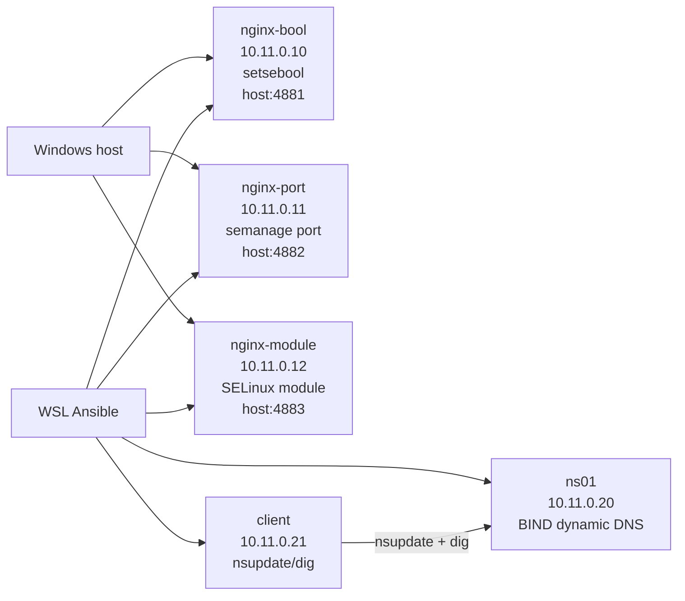

# Задание 11: Практика с SELinux

## Цель

Диагностировать проблемы SELinux и настроить политики так, чтобы приложения работали в режиме `Enforcing`.

Работа состоит из двух частей:

1. Запустить nginx на нестандартном порту `4881` тремя разными способами.
2. Обеспечить работоспособность динамического обновления DNS-зоны при включенном SELinux.

## Стенд



В оригинальном стенде `selinux_dns_problems` используются адреса `192.168.50.10` для `ns01` и `192.168.50.15` для `client`. В этом репозитории выбран отдельный диапазон `10.11.0.0/24`, чтобы не конфликтовать с другими домашними заданиями и локальными VirtualBox-сетями.

Ansible запускается из WSL и подключается к VM через forwarded SSH-порты на `127.0.0.1`. В актуальном WSL с mirrored networking Windows localhost доступен напрямую.

| VM | IP | SSH port | Назначение |
| --- | --- | --- | --- |
| `nginx-bool` | `10.11.0.10` | `2450` | nginx через `setsebool` |
| `nginx-port` | `10.11.0.11` | `2451` | nginx через `semanage port` |
| `nginx-module` | `10.11.0.12` | `2452` | nginx через локальный SELinux-модуль |
| `ns01` | `10.11.0.20` | `2453` | DNS-сервер |
| `client` | `10.11.0.21` | `2454` | DNS-клиент |

HTTP-проверка с Windows host:

| URL | Способ |
| --- | --- |
| `http://127.0.0.1:4881/` | `setsebool` |
| `http://127.0.0.1:4882/` | `semanage port` |
| `http://127.0.0.1:4883/` | SELinux-модуль |

## Структура Ansible

Playbook разделен на роли:

| Роль | Что делает |
| --- | --- |
| `nginx_selinux` | устанавливает nginx, включает `Enforcing`, настраивает порт `4881` одним из трех способов |
| `dns_server` | устанавливает BIND, создает зоны `dns.lab` и `ddns.lab`, исправляет SELinux-контексты |
| `dns_client` | устанавливает `bind-utils` и копирует ключ для `nsupdate` |

Выбор способа для nginx задается переменной `selinux_nginx_method` в `ansible/inventory.ini`.

## Задание 1: nginx на нестандартном порту

### Требование

Запустить nginx на нестандартном порту `4881` тремя разными способами:

- переключатель `setsebool`;
- добавление нестандартного порта в имеющийся тип;
- формирование и установка модуля SELinux.

Формат сдачи: README с описанием каждого решения. Скриншоты и демонстрация приветствуются.

### Причина блокировки

nginx работает в SELinux-домене `httpd_t`. По умолчанию этот домен может слушать только порты, размеченные типом `http_port_t`. Порт `4881/tcp` не входит в стандартный набор HTTP-портов, поэтому при запуске nginx SELinux запрещает операцию `name_bind` к порту с типом `unreserved_port_t`.

Типовой признак в audit-логе:

```text
denied { name_bind } for ... scontext=...:httpd_t:... tcontext=...:unreserved_port_t:... tclass=tcp_socket
```

### Способ 1: переключатель setsebool

Реализован на VM `nginx-bool`.

Команды:

```bash
setsebool -P nis_enabled on
systemctl restart nginx
curl http://127.0.0.1:4881/
```

В Ansible это делает роль `nginx_selinux`, когда у хоста задано:

```ini
selinux_nginx_method=boolean
```

Проверка:

```bash
getenforce
getsebool nis_enabled
curl http://127.0.0.1:4881/
```

Результат:

```text
Enforcing
nis_enabled --> on
SELinux allows nginx on tcp/4881
```

Решение рабочее, но широкое: boolean `nis_enabled` разрешает больше, чем требуется только для nginx на одном нестандартном порту.

### Способ 2: добавление порта в существующий тип

Реализован на VM `nginx-port`.

Команды:

```bash
semanage port -a -t http_port_t -p tcp 4881
systemctl restart nginx
curl http://127.0.0.1:4881/
```

В Ansible это делает роль `nginx_selinux`, когда у хоста задано:

```ini
selinux_nginx_method=port
```

Проверка:

```bash
getenforce
semanage port -l | grep '^http_port_t'
curl http://127.0.0.1:4881/
```

Результат:

```text
Enforcing
http_port_t tcp ... 4881 ...
SELinux allows nginx on tcp/4881
```

Это наиболее точечный и предпочтительный способ для данной задачи: политика SELinux явно получает информацию, что `4881/tcp` является HTTP-портом.

### Способ 3: формирование и установка SELinux-модуля

Реализован на VM `nginx-module`.

Роль `nginx_selinux` создает модуль `nginx_4881`, компилирует его и устанавливает через `semodule`.

Команды:

```bash
checkmodule -M -m -o /tmp/nginx_4881.mod /tmp/nginx_4881.te
semodule_package -o /tmp/nginx_4881.pp -m /tmp/nginx_4881.mod
semodule -i /tmp/nginx_4881.pp
systemctl restart nginx
curl http://127.0.0.1:4881/
```

Содержимое правила:

```text
allow httpd_t unreserved_port_t:tcp_socket name_bind;
```

Проверка:

```bash
getenforce
semodule -l | grep nginx_4881
curl http://127.0.0.1:4881/
```

Результат:

```text
Enforcing
nginx_4881
SELinux allows nginx on tcp/4881
```

Для обычного нестандартного HTTP-порта этот способ менее аккуратен, чем `semanage port`, потому что разрешает `httpd_t` bind к типу `unreserved_port_t`. Но он демонстрирует требуемый механизм формирования и установки локального SELinux-модуля.

## Задание 2: DNS и SELinux

### Требование

Обеспечить работоспособность приложения при включенном SELinux.

Нужно:

- развернуть стенд по мотивам `https://github.com/mbfx/otus-linux-adm/tree/master/selinux_dns_problems`;
- выяснить причину неработоспособности механизма обновления зоны;
- предложить решение или решения;
- выбрать одно решение и обосновать выбор;
- реализовать выбранное решение;
- продемонстрировать работоспособность.

Формат сдачи: README с анализом причины, возможными способами решения и обоснованием выбора одного из них; исправленный стенд или демонстрация работоспособной системы.

### Исходная проблема

В оригинальном стенде есть DNS-сервер `ns01` и клиент `client`. При попытке с клиента добавить запись в динамическую зону `ddns.lab` команда завершается ошибкой:

```bash
nsupdate -k /etc/named.zonetransfer.key
server 192.168.50.10
zone ddns.lab
update add www.ddns.lab. 60 A 192.168.50.15
send
```

Результат:

```text
update failed: SERVFAIL
```

В этом стенде используются адреса:

```bash
nsupdate -k /etc/named.zonetransfer.key
server 10.11.0.20
zone ddns.lab
update add www.ddns.lab. 60 A 10.11.0.21
send
```

### Анализ причины

Конфигурация BIND и ключ обновления корректны. Ошибка связана с SELinux-контекстом файлов зоны.

Зоны размещены в каталоге `/etc/named`, а стандартная политика SELinux назначает файлам в этом месте тип `named_conf_t`. Этот тип подходит для конфигурационных файлов, но не для динамически изменяемых файлов зон.

Процесс `named` работает в домене `named_t`. Для динамического обновления зоны ему нужно создавать и изменять файлы зоны и journal-файлы. При контексте `named_conf_t` SELinux запрещает запись, из-за чего `nsupdate` получает `SERVFAIL`.

Диагностические команды:

```bash
getenforce
ls -Z /etc/named /etc/named/dynamic
ausearch -m AVC -c named
```

Ожидаемый проблемный признак:

```text
type=AVC ... denied ... comm="isc-net-0000" name="named.ddns.lab.jnl" ... scontext=...:named_t:... tcontext=...:named_conf_t:...
```

Причина: неверный SELinux-тип для файлов зон. Для зон BIND должен использоваться тип `named_zone_t`, как у файлов под `/var/named`.

### Возможные решения

1. Временно изменить контекст командой `chcon`:

```bash
chcon -R -t named_zone_t /etc/named
systemctl restart named
```

Плюс: быстро и удобно для проверки гипотезы.

Минус: изменение временное и может быть потеряно после `restorecon` или переустановки контекстов.

2. Перенести зоны в стандартный каталог `/var/named`:

```bash
mv /etc/named/named.dns.lab /var/named/
mv /etc/named/dynamic/named.ddns.lab /var/named/dynamic/
restorecon -R /var/named
```

Плюс: соответствует стандартной политике BIND.

Минус: сильнее меняет структуру исходного стенда.

3. Добавить постоянное правило SELinux-контекста:

```bash
semanage fcontext -a -t named_zone_t '/etc/named(/.*)?'
restorecon -R /etc/named
systemctl restart named
```

Плюс: сохраняет структуру исходного стенда и переживает `restorecon`/перезагрузку.

Минус: нужно явно сопровождать локальное правило SELinux.

4. Сгенерировать локальный модуль через `audit2allow`:

```bash
ausearch -m AVC -c named | audit2allow -M named_ddns
semodule -i named_ddns.pp
```

Плюс: позволяет закрыть нестандартные запреты.

Минус: в этой задаче проблема не в отсутствующем разрешении, а в неверном типе файлов. Генерировать новое разрешение вместо исправления контекста избыточно.

### Выбранное решение

Выбрано постоянное правило `semanage fcontext`:

```bash
semanage fcontext -a -t named_zone_t '/etc/named(/.*)?'
restorecon -R /etc/named
```

Обоснование:

- сохраняется структура исходного стенда с зонами в `/etc/named`;
- решение устойчиво к `restorecon` и перезагрузке;
- исправляется именно причина проблемы: неправильный тип файлов зоны;
- не расширяются разрешения SELinux сверх необходимого.

Реализация находится в роли `dns_server`.

### Демонстрация работоспособности

Проверка с клиента:

```bash
nsupdate -k /etc/named.zonetransfer.key <<'NSUPDATE'
server 10.11.0.20
zone ddns.lab
update delete www.ddns.lab. A
update add www.ddns.lab. 60 A 10.11.0.21
send
NSUPDATE

dig +short @10.11.0.20 www.ddns.lab A
```

Результат:

```text
10.11.0.21
```

Дополнительная проверка SELinux:

```bash
getenforce
find /etc/named -maxdepth 2 -printf '%p %Z\n'
```

Результат:

```text
Enforcing
/etc/named named_zone_t
/etc/named/dynamic named_zone_t
/etc/named/dynamic/named.ddns.lab named_zone_t
```

## Запуск

Из Windows PowerShell:

```powershell
cd C:\Users\dandy\administrator-linux-professional\task-11-selinux
vagrant up
```

Из WSL сначала нужно скопировать стандартный Vagrant-ключ с Windows-файловой системы. Использовать ключ прямо из `/mnt/c` нельзя: OpenSSH отклоняет его из-за прав DrvFS `0777`.

```bash
mkdir -p ~/.ssh
cp /mnt/c/Users/dandy/.vagrant.d/insecure_private_key ~/.ssh/task11_vagrant_insecure_key
chmod 600 ~/.ssh/task11_vagrant_insecure_key

cd /mnt/c/Users/dandy/administrator-linux-professional/task-11-selinux
export ANSIBLE_CONFIG="$PWD/ansible.cfg"
ansible-playbook -i ansible/inventory.ini ansible/playbook.yml -f 1
ansible-playbook -i ansible/inventory.ini ansible/test.yml -f 1
```

`ANSIBLE_CONFIG` задается явно, потому что Ansible игнорирует конфигурационный файл в каталоге `/mnt/c`, который WSL считает доступным на запись всем пользователям. Если ресурсов достаточно, параметр `-f 1` можно убрать.

Проверка HTTP с Windows:

```powershell
curl.exe http://127.0.0.1:4881/
curl.exe http://127.0.0.1:4882/
curl.exe http://127.0.0.1:4883/
```

## Автоматическая проверка

`ansible/test.yml` проверяет:

- SELinux находится в режиме `Enforcing`;
- `nginx-bool` использует `nis_enabled`;
- `nginx-port` имеет `4881/tcp` в типе `http_port_t`;
- `nginx-module` имеет установленный модуль `nginx_4881`;
- все три nginx отвечают на порту `4881` внутри своих VM;
- `/etc/named` размечен типом `named_zone_t`;
- `named` запущен;
- клиент успешно добавляет запись через `nsupdate`;
- `dig @10.11.0.20 www.ddns.lab A` возвращает `10.11.0.21`.

Контрольный прогон 05.09.2026 на Windows/Vagrant 2.4.9, VirtualBox и WSL/Ansible core 2.17.14:

```text
ansible-playbook -i ansible/inventory.ini ansible/playbook.yml -f 1
client:       ok=3  changed=2  unreachable=0 failed=0
nginx_bool:  ok=7  changed=4  unreachable=0 failed=0
nginx_module:ok=10 changed=5  unreachable=0 failed=0
nginx_port:  ok=8  changed=4  unreachable=0 failed=0
ns01:        ok=16 changed=8  unreachable=0 failed=0

ansible-playbook -i ansible/inventory.ini ansible/test.yml -f 1
client:       ok=3 changed=0 unreachable=0 failed=0
nginx_bool:  ok=4 changed=0 unreachable=0 failed=0
nginx_module:ok=4 changed=0 unreachable=0 failed=0
nginx_port:  ok=4 changed=0 unreachable=0 failed=0
ns01:        ok=5 changed=0 unreachable=0 failed=0

Windows HTTP: порты 4881, 4882 и 4883 вернули
`SELinux allows nginx on tcp/4881`.
```
