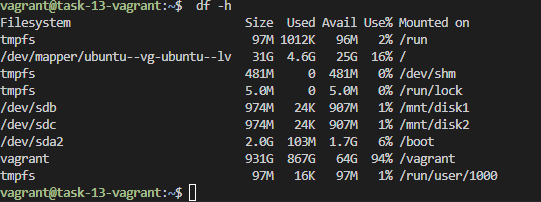
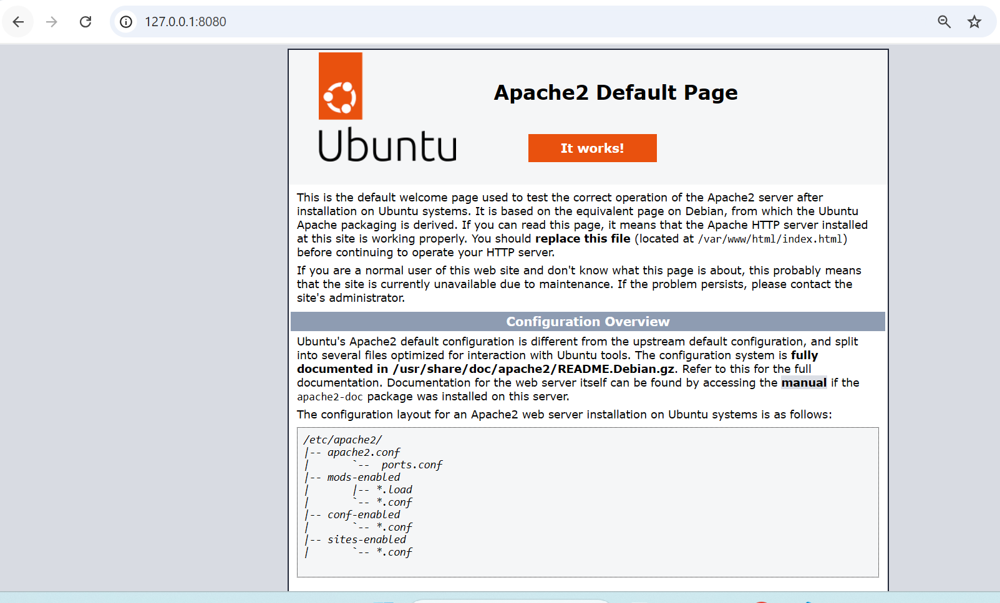
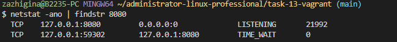

# Задание 13: Vagrant

## Цель домашнего задания

Научиться добавлять диски и настраивать сетевые соединения;

## Описание домашнего задания

Необходимо подготовить Vagrant-стенд на базе VirtualBox со следующими параметрами:

- одна виртуальная машина на базе Ubuntu;
- оперативная память: `1024 MB`;
- два дополнительных виртуальных диска по `1 GB`;
- проброс порта `80` из гостевой системы на `8080` хостовой машины;
- бонус: установка и запуск `apache2` для проверки работы проброса порта.

Во время provisioning виртуальная машина должна:

- отформатировать оба дополнительных диска в файловую систему `ext4`;
- создать точки монтирования `/mnt/disk1` и `/mnt/disk2`;
- смонтировать диски в указанные директории;
- добавить записи в `/etc/fstab` для автоматического монтирования после перезагрузки.

## Стенд

Для создания виртуальной машины используется `Vagrantfile`.

В стенде создается одна виртуальная машина:

- имя хоста: `task-13-vagrant`;
- box: `bento-ubuntu-24.04-local`;
- оперативная память: `1024 MB`;
- CPU: `1`;
- сеть:
  - `private_network`: `192.168.56.13`;
  - `forwarded_port`: `127.0.0.1:8080 -> guest:80`.

Также при старте ВМ подключаются два дополнительных диска:

- `disk1` размером `1 GB`;
- `disk2` размером `1 GB`.

## Основная логика работы

`Vagrantfile` создает виртуальную машину в VirtualBox, настраивает память, приватную сеть и проброс порта `8080` на HTTP-порт гостевой системы. Дополнительно к ВМ подключаются два виртуальных диска по `1 GB` через `srv.vm.disk`.

Во время provisioning выполняется установка `apache2`, после чего оба новых диска форматируются в `ext4`, для них создаются каталоги `/mnt/disk1` и `/mnt/disk2`, а затем на основе `UUID` формируются записи в `/etc/fstab`.

После запуска стенда содержимое папки проекта должно открываться на хостовой машине по адресу `http://127.0.0.1:8080`.

## Инструкция по запуску стенда

Из папки задания:

```bash
vagrant up
```

Подключиться к виртуальной машине:

```bash
vagrant ssh
```

## Проверка

Проверка, что диски смонтированы:

```bash
$ df -h
Filesystem                         Size  Used Avail Use% Mounted on
tmpfs                               97M 1012K   96M   2% /run
/dev/mapper/ubuntu--vg-ubuntu--lv   31G  4.6G   25G  16% /
tmpfs                              481M     0  481M   0% /dev/shm
tmpfs                              5.0M     0  5.0M   0% /run/lock
/dev/sdb                           974M   24K  907M   1% /mnt/disk1
/dev/sdc                           974M   24K  907M   1% /mnt/disk2
/dev/sda2                          2.0G  103M  1.7G   6% /boot
vagrant                            931G  867G   64G  94% /vagrant
tmpfs                               97M   16K   97M   1% /run/user/1000
```


Проверка проброса порта на хостовой машине:

```bash
$ curl http://127.0.0.1:8080
<!DOCTYPE html PUBLIC "-//W3C//DTD XHTML 1.0 Transitional//EN" "http://www.w3.org/TR/xhtml1/DTD/xhtml1-transitional.dtd">
<html xmlns="http://www.w3.org/1999/xhtml">
  <!--
    Modified from the Debian original for Ubuntu
    Last updated: 2022-03-22
    See: https://launchpad.net/bugs/1966004
  -->
  <head>
    <meta http-equiv="Content-Type" content="text/html; charset=UTF-8" />
    <title>Apache2 Ubuntu Default Page: It works</title>
    <style type="text/css" media="screen">
  * {
    margin: 0px 0px 0px 0px;
    padding: 0px 0px 0px 0px;
...............
```




Проверка портов:

```bash
$ netstat -ano | findstr 8080
  TCP    127.0.0.1:8080         0.0.0.0:0              LISTENING       21992
  TCP    127.0.0.1:59302        127.0.0.1:8080         TIME_WAIT       0
```


