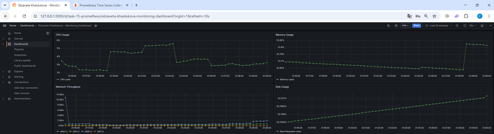

# Задание 15: Настройка мониторинга с Prometheus и Grafana

## Цель домашнего задания

Поднять стенд мониторинга и настроить дашборд Grafana с четырьмя графиками:

- память;
- процессор;
- диск;
- сеть.

## Что входит в решение

В каталоге `task-15-prometheus` подготовлен Vagrant-стенд с одной виртуальной машиной Ubuntu, на которой автоматически устанавливаются и запускаются:

- `node_exporter` для сбора метрик хоста;
- `Prometheus` для хранения и опроса метрик;
- `Grafana` для визуализации.

## Стенд

Используется одна виртуальная машина со следующими параметрами:

- hostname: `task-15-prometheus`;
- box: `bento/ubuntu-24.04`;
- RAM: `2048 MB`;
- CPU: `2`;
- private IP: `192.168.56.15`;
- проброс портов:
  - `3000` -> Grafana;
  - `9090` -> Prometheus.

## Состав файлов

- `Vagrantfile` - описание виртуальной машины;
- `provision.sh` - установка Prometheus, Grafana и node_exporter;
- `prometheus.yml` - конфигурация Prometheus;
- `prometheus.service` - unit-файл Prometheus;
- `node_exporter.service` - unit-файл node_exporter;

## Запуск

Из папки задания:

```bash
vagrant up
```

Подключение к ВМ:

```bash
vagrant ssh
```

## Что настраивается автоматически

После `vagrant up` на машине должны быть доступны:

- Prometheus: `http://192.168.56.15:9090` или `http://127.0.0.1:9090`;
- Grafana: `http://192.168.56.15:3000` или `http://127.0.0.1:3000`.

Параметры входа в Grafana по умолчанию:

- login: `admin`
- password: `admin`

## Проверка

Проверить статус сервисов внутри ВМ:

```bash
$ sudo systemctl status node_exporter
$ sudo systemctl status prometheus
$ sudo systemctl status grafana-server
```

Проверить, что Prometheus видит цели:

```bash
$ curl http://127.0.0.1:9090/api/v1/targets | jq .
  % Total    % Received % Xferd  Average Speed   Time    Time     Time  Current
                                 Dload  Upload   Total   Spent    Left  Speed
100  1135  100  1135    0     0   271k      0 --:--:-- --:--:-- --:--:--  369k
{
  "status": "success",
  "data": {
    "activeTargets": [
      {
        "discoveredLabels": {
          "__address__": "localhost:9100",
          "__metrics_path__": "/metrics",
          "__scheme__": "http",
          "__scrape_interval__": "15s",
          "__scrape_timeout__": "10s",
          "job": "node_exporter"
        },
        "labels": {
          "instance": "localhost:9100",
          "job": "node_exporter"
        },
        "scrapePool": "node_exporter",
        "scrapeUrl": "http://localhost:9100/metrics",
        "globalUrl": "http://vagrant:9100/metrics",
        "lastError": "",
        "lastScrape": "2026-06-21T17:55:09.586949319Z",
        "lastScrapeDuration": 0.034609357,
        "health": "up",
        "scrapeInterval": "15s",
        "scrapeTimeout": "10s"
      },
      {
        "discoveredLabels": {
          "__address__": "localhost:9090",
          "__metrics_path__": "/metrics",
          "__scheme__": "http",
          "__scrape_interval__": "15s",
          "__scrape_timeout__": "10s",
          "job": "prometheus"
        },
        "labels": {
          "instance": "localhost:9090",
          "job": "prometheus"
        },
        "scrapePool": "prometheus",
        "scrapeUrl": "http://localhost:9090/metrics",
        "globalUrl": "http://vagrant:9090/metrics",
        "lastError": "",
        "lastScrape": "2026-06-21T17:55:03.148844322Z",
        "lastScrapeDuration": 0.009888574,
        "health": "up",
        "scrapeInterval": "15s",
        "scrapeTimeout": "10s"
      }
    ],
    "droppedTargets": [],
    "droppedTargetCounts": {
      "node_exporter": 0,
      "prometheus": 0
    }
  }
}
```

Проверить, что node_exporter отдает метрики:

```bash
$ curl http://127.0.0.1:9100/metrics | head
  % Total    % Received % Xferd  Average Speed   Time    Time     Time  Current
                                 Dload  Upload   Total   Spent    Left  Speed
  0     0    0     0    0     0      0      0 --:--:-- --:--:-- --:--:--     0# HELP go_gc_duration_seconds A summary of the pause duration of garbage collection cycles.
# TYPE go_gc_duration_seconds summary
go_gc_duration_seconds{quantile="0"} 2.8736e-05
go_gc_duration_seconds{quantile="0.25"} 3.7279e-05
go_gc_duration_seconds{quantile="0.5"} 4.9024e-05
go_gc_duration_seconds{quantile="0.75"} 6.6058e-05
go_gc_duration_seconds{quantile="1"} 0.0019842
go_gc_duration_seconds_sum 0.003891328
go_gc_duration_seconds_count 13
# HELP go_goroutines Number of goroutines that currently exist.
100  8192    0  8192    0     0   315k      0 --:--:-- --:--:-- --:--:--  320k
```

Проверить, что Grafana слушает порт:

```bash
$ sudo ss -tulpn | grep 3000
tcp   LISTEN 0      4096                *:3000            *:*    users:(("grafana",pid=2813,fd=10))
```

Скриншот построенного дашборда:



Готовый dashboard хранится в файле [dashboard-task-15.json](./dashboard-task-15.json).