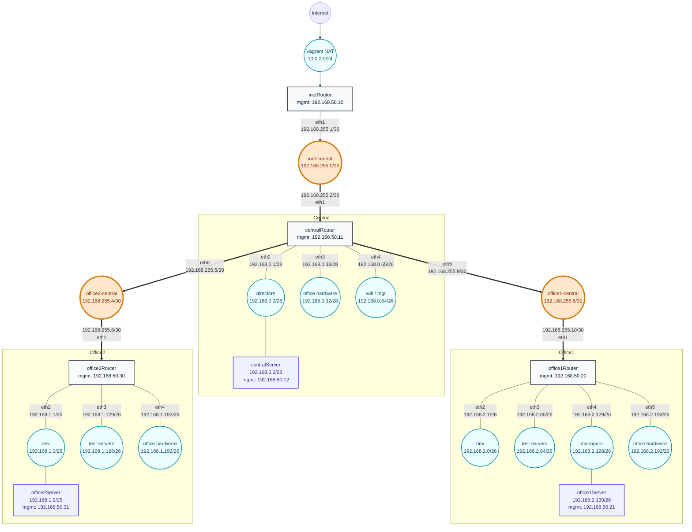

# Задание 19: Разворачиваем сетевую лабораторию

## Цель домашнего задания

Научиться настраивать статическую маршрутизацию, NAT и транзитную маршрутизацию в Linux.

## Текст задания

Нужно развернуть полную сетевую схему из методички и настроить:

- `inetRouter`
- `centralRouter`
- `office1Router`
- `office2Router`
- `centralServer`
- `office1Server`
- `office2Server`

Требования:

- интернет-трафик со всех серверов должен идти через `inetRouter`;
- все сервера должны видеть друг друга;
- у всех новых серверов должен быть отключен default route через NAT-интерфейс `enp0s3`, который Vagrant поднимает для связи;
- настройка выполняется через `Vagrant` и `Ansible`.

## Схема сети



## Теоретическая часть

### Используемые подсети

| Name | Network | Netmask | Hostmin | Hostmax | Hosts | Broadcast |
| --- | --- | --- | --- | --- | --- | --- |
| Directors | `192.168.0.0/28` | `255.255.255.240` | `192.168.0.1` | `192.168.0.14` | 14 | `192.168.0.15` |
| Office hardware | `192.168.0.32/28` | `255.255.255.240` | `192.168.0.33` | `192.168.0.46` | 14 | `192.168.0.47` |
| Wifi (mgt) | `192.168.0.64/26` | `255.255.255.192` | `192.168.0.65` | `192.168.0.126` | 62 | `192.168.0.127` |
| Office1 dev | `192.168.2.0/26` | `255.255.255.192` | `192.168.2.1` | `192.168.2.62` | 62 | `192.168.2.63` |
| Office1 test | `192.168.2.64/26` | `255.255.255.192` | `192.168.2.65` | `192.168.2.126` | 62 | `192.168.2.127` |
| Office1 managers | `192.168.2.128/26` | `255.255.255.192` | `192.168.2.129` | `192.168.2.190` | 62 | `192.168.2.191` |
| Office1 hardware | `192.168.2.192/26` | `255.255.255.192` | `192.168.2.193` | `192.168.2.254` | 62 | `192.168.2.255` |
| Office2 dev | `192.168.1.0/25` | `255.255.255.128` | `192.168.1.1` | `192.168.1.126` | 126 | `192.168.1.127` |
| Office2 test | `192.168.1.128/26` | `255.255.255.192` | `192.168.1.129` | `192.168.1.190` | 62 | `192.168.1.191` |
| Office2 hardware | `192.168.1.192/26` | `255.255.255.192` | `192.168.1.193` | `192.168.1.254` | 62 | `192.168.1.255` |
| Inet-central | `192.168.255.0/30` | `255.255.255.252` | `192.168.255.1` | `192.168.255.2` | 2 | `192.168.255.3` |
| Office2-central | `192.168.255.4/30` | `255.255.255.252` | `192.168.255.5` | `192.168.255.6` | 2 | `192.168.255.7` |
| Office1-central | `192.168.255.8/30` | `255.255.255.252` | `192.168.255.9` | `192.168.255.10` | 2 | `192.168.255.11` |

### Свободные подсети

| Network | Netmask | Hostmin | Hostmax | Broadcast |
| --- | --- | --- | --- | --- |
| `192.168.0.16/28` | `255.255.255.240` | `192.168.0.17` | `192.168.0.30` | `192.168.0.31` |
| `192.168.0.48/28` | `255.255.255.240` | `192.168.0.49` | `192.168.0.62` | `192.168.0.63` |
| `192.168.0.128/25` | `255.255.255.128` | `192.168.0.129` | `192.168.0.254` | `192.168.0.255` |
| `192.168.255.12/30` | `255.255.255.252` | `192.168.255.13` | `192.168.255.14` | `192.168.255.15` |
| `192.168.255.16/28` | `255.255.255.240` | `192.168.255.17` | `192.168.255.30` | `192.168.255.31` |
| `192.168.255.32/27` | `255.255.255.224` | `192.168.255.33` | `192.168.255.62` | `192.168.255.63` |
| `192.168.255.64/26` | `255.255.255.192` | `192.168.255.65` | `192.168.255.126` | `192.168.255.127` |

Ошибок в разбиении сетей нет.

## Что настраивается

- все 7 виртуальных машин поднимаются на `generic/ubuntu2004`;
- `Ansible` подключается по отдельной management-сети `192.168.50.0/24`;
- `Vagrant SSH forwarded ports` (`2230-2236`) остаются как аварийный доступ для ручного восстановления;
- сетевые настройки и маршруты задаются через `netplan` файлами `00-installer-config.yaml` и `50-vagrant_<host>.yaml`;
- на всех хостах, кроме `inetRouter`, отключается получение default route через `enp0s3`;
- на роутерах включается IP forwarding;
- на `inetRouter` настраивается NAT через `iptables`;
- на `centralRouter` добавляются маршруты в сети `office1` и `office2`;
- на `office1Router` и `office2Router` трафик в центральные и внешние сети идет через `centralRouter`;
- на серверах прописывается default route в сторону своего роутера.

## Запуск

### 1. Поднять стенд

```bash
vagrant up
```

### 2. Запустить настройку из WSL

```bash
cd /mnt/c/Users/zazhigina/administrator-linux-professional/task-19-network-lab
ANSIBLE_CONFIG=/mnt/c/Users/zazhigina/administrator-linux-professional/task-19-network-lab/ansible.cfg ansible-playbook ansible/playbook.yml
```

### 3. Запустить проверки

```bash
ANSIBLE_CONFIG=/mnt/c/Users/zazhigina/administrator-linux-professional/task-19-network-lab/ansible.cfg ansible-playbook ansible/test.yml
```