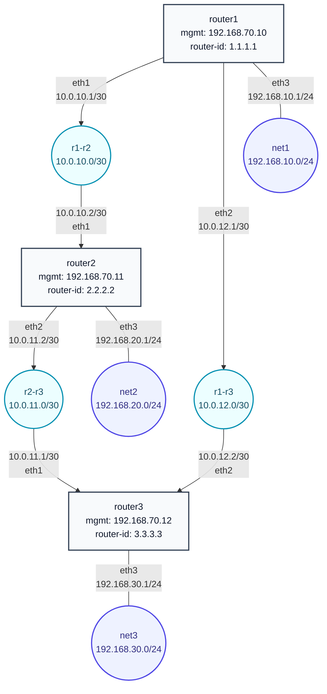

# Задание 22: OSPF

## Цель домашнего задания

Создать домашнюю сетевую лабораторию и научиться настраивать протокол OSPF в Linux-based системах.

## Что нужно сделать

Нужно развернуть стенд `Vagrant + Ansible` из 3 виртуальных машин:

- `router1`;
- `router2`;
- `router3`.

Требования из методички:

- объединить роутеры разными VLAN/private networks;
- настроить OSPF между машинами на базе FRR, преемника Quagga;
- показать асимметричный роутинг;
- сделать один из линков дорогим так, чтобы итоговая маршрутизация была симметричной.

## Схема сети



## Что настраивает Ansible

- устанавливает базовые пакеты `curl`, `gnupg`, `iproute2`, `netplan.io`, `traceroute`;
- добавляет репозиторий FRR из методички и устанавливает `frr`, `frr-pythontools`;
- включает IPv4 forwarding и отключает `rp_filter`;
- включает демоны `zebra` и `ospfd` в `/etc/frr/daemons`;
- создает `/etc/frr/frr.conf` для каждого роутера;
- на обоих концах линка `router1-router2` задает OSPF cost `1000`, поэтому трафик между `router1` и `router2` идет симметрично через `router3`.

## Запуск

В Windows:

```powershell
cd C:\Users\zazhigina\administrator-linux-professional\task-22-ospf
vagrant up
```

В WSL:

```bash
cd /mnt/c/Users/zazhigina/administrator-linux-professional/task-22-ospf
ANSIBLE_CONFIG=/mnt/c/Users/zazhigina/administrator-linux-professional/task-22-ospf/ansible.cfg ansible-playbook ansible/playbook.yml
```

## Проверка

Запустить автоматические проверки:

```bash
cd /mnt/c/Users/zazhigina/administrator-linux-professional/task-22-ospf
ANSIBLE_CONFIG=/mnt/c/Users/zazhigina/administrator-linux-professional/task-22-ospf/ansible.cfg ansible-playbook ansible/test.yml
```

Что делает `ansible/test.yml`:

1. Проверяет, что сервис `frr` запущен на всех трех роутерах.
2. Проверяет, что FRR видит OSPF-маршруты командой `vtysh -c "show ip route ospf"`.
3. Проверяет доступность локальных сетей `192.168.10.0/24`, `192.168.20.0/24`, `192.168.30.0/24` через `ping`.
4. Проверяет постоянное состояние: дорогой линк `router1-router2` настроен симметрично, поэтому `router1 -> router2` и `router2 -> router1` идут через `router3`.
5. Временно делает cost на `router2 eth1` равным `100`.
6. Проверяет асимметрию: `router1 -> router2` идет через `router3`, а `router2 -> router1` выбирает прямой next-hop `10.0.10.1` через `eth1`.
7. Возвращает cost на `router2 eth1` обратно в `1000`.

Ручные проверки из методички:

```bash
vagrant ssh router1
sudo -i
ping -c 2 192.168.30.1
traceroute -n 192.168.20.1
vtysh -c "show ip route ospf"
```

Ожидаемо `traceroute -n 192.168.20.1` с `router1` идет через `10.0.12.2`, потому что прямой линк `router1-router2` сделан дорогим с обеих сторон.

Для демонстрации асимметричного роутинга по методичке можно временно сделать дорогим только интерфейс `router1 -> router2`:

```bash
vagrant ssh router2
sudo vtysh
conf t
interface eth1
ip ospf cost 100
end
write memory
show ip route ospf
```

После этого путь `router1 -> router2` останется через `router3`, а обратный путь `router2 -> router1` сможет идти напрямую через `10.0.10.1`.
